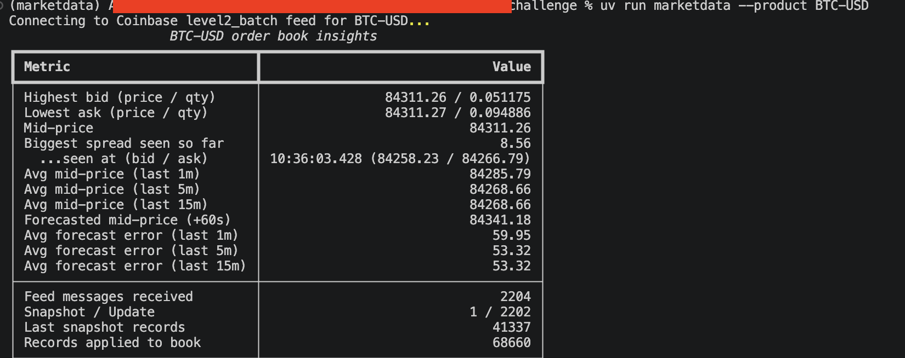
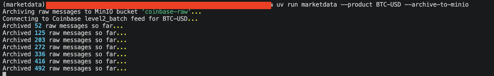
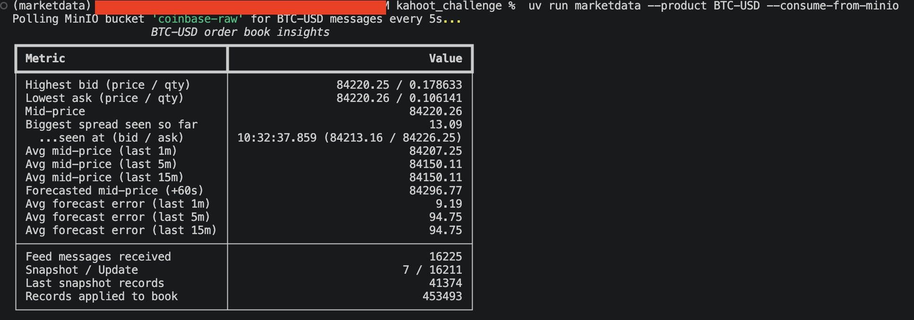
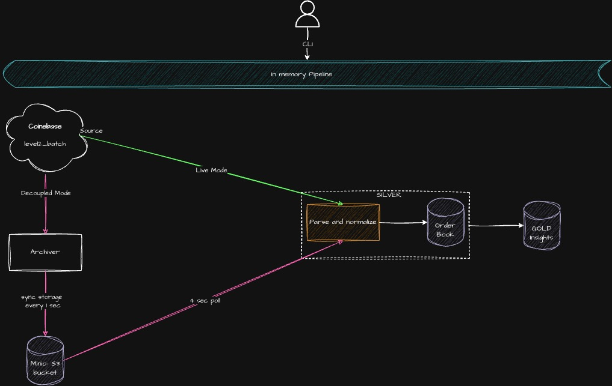

# Coinbase Order Book Monitor

A terminal dashboard for live Coinbase order-book insights, with an optional
MinIO archive-and-consume workflow for decoupled processing.

The monitor subscribes to Coinbase Exchange's public `level2_batch` WebSocket
feed. No Coinbase API credentials are required.

| | |
| --- | --- |
| **Market data** | Coinbase Exchange `level2_batch` |
| **Display refresh** | Every 5 seconds |
| **Metrics** | Best bid/ask, mid-price, rolling averages, 60-second forecast, forecast error, widest observed spread |
| **Runtime** | Python 3.12+ managed with [uv](https://docs.astral.sh/uv/) |

## Quick Start

Requirements: `uv` and internet access to `wss://ws-feed.exchange.coinbase.com`.

```bash
uv sync
uv run marketdata --product BTC-USD
```

The product defaults to `BTC-USD`; pass another Coinbase product, for example
`--product ETH-EUR`. The dashboard appears after the first order-book snapshot.
Stop the process with `Ctrl+C`.



## Processing Modes

The default mode reads directly from Coinbase and renders the dashboard. For
decoupled processing, run a MinIO producer and consumer in separate terminals.
They share data through a bucket; this repository does not start MinIO for you.

| Mode | Command | What it does |
| --- | --- | --- |
| **Live** | `uv run marketdata --product BTC-USD` | Reads the feed and renders metrics in the terminal. |
| **Archive producer** | `uv run marketdata --product BTC-USD --archive-to-minio` | Connects to Coinbase and writes raw messages to MinIO. |
| **Archive consumer** | `uv run marketdata --product BTC-USD --consume-from-minio` | Reads archived messages from MinIO and renders its own dashboard. |

### Configure MinIO

Copy `.env.example` to `.env`, then set the endpoint, credentials, TLS option,
and bucket for your MinIO or S3-compatible service:

```bash
cp .env.example .env
```

Start the producer first, then start the consumer in another terminal. Both
processes need access to the same bucket and compatible settings.

### Terminal 1


### Terminal 2


### Live vs. Near-Live Comparison

https://github.com/user-attachments/assets/edb8f956-d2fb-4853-b262-6376ce1dfda1

## Architecture

In live mode, feed messages pass through normalization, order-book updates, and
metric calculations before reaching the terminal. In archive mode, ingestion
and processing are separate: the producer stores raw messages and the consumer
runs the same processing path from the bucket.



See the [design notes](docs/design.md) for metric definitions, modelling
choices, and limitations. The [Azure architecture](docs/azure-architecture.md)
describes a proposed cloud deployment and its reliability model.

### Archive behavior and limits

- The producer batches raw messages and uploads them to MinIO about once per
	second. Failed uploads are retried with the same envelope event IDs.
- The consumer finds the newest archived snapshot, then replays subsequent
	records in order before polling for new objects every four seconds. Repeated
	envelope IDs are ignored; legacy bare messages are also supported.
- Event IDs deduplicate archived-envelope replays, not independently repeated
	Coinbase source messages. The feed does not provide a sequence number for that.
- The consumer keeps its order book and processed-object/event-ID lists in
	memory. On restart, it searches backward for the newest snapshot and replays
	from there; no checkpoint is persisted between runs.

## Development

Run the test suite and lint checks with:

```bash
uv run pytest
uv run ruff check
```

## Working with AI

**What I delegated**

I used an AI coding agent to implement much of the order book, rolling-window calculations, Coinbase feed integration, forecasting, CLI, and tests. I reviewed and tested the generated changes rather than treating the output as production-ready.

**What I designed myself**

The order book schema was specified in the challenge, but I designed the internal data flow and the structures around that schema. I also designed the MinIO producer/consumer decoupling, which can be reused in a cloud environment. This preserves the raw feed archive for traceability while allowing a separate consumer to process the data independently.

I chose `uv` and Coinbase's public `level2_batch` channel myself after researching the available options.

**Trade-offs**

The implementation became more fragmented than this relatively small task requires. Following a feed message through normalization, the order book, metrics, and display currently involves several modules and layers.

This separation does have a purpose: the same processing path can be reused for both the live feed and an archived-data consumer. However, I would simplify the surrounding structure where the separation does not provide clear value.

**What the agent got wrong**

The agent made two notable mistakes that I caught through review and testing.

- First, the WebSocket client's default 1 MB frame limit was too small for the BTC-USD snapshot. This caused the connection to drop when the snapshot was received. A live run exposed the issue because the unit tests used smaller synthetic snapshots.

- Second, the initial rolling-window implementation gave equal weight to each observed mid-price rather than weighting each value by the amount of time it was valid. I identified this by comparing the implementation's result with manually calculated examples.

- Third, the initial decoupled consumer buit from AI replayed too much history before reaching the current order book. A better approach is to search the sorted MinIO objects backward for the newest snapshot, then replay that snapshot and	subsequent records. This avoids processing older archived data and reduces startup time.


**Where I would not use an agent unsupervised**

I would not delegate the core model and architecture design to an AI agent without close supervision. The current model design was iterative, considering both local execution and how parts of the system could later run in a cloud environment.

The agent initially overlooked some of the architectural intent, particularly the value of decoupling ingestion from processing through the raw archive. Rather than asking the agent to design the entire system, I broke the problem into smaller pieces, made the architectural decisions myself, and then used AI selectively to implement and test those pieces.

This approach allowed me to benefit from the agent's implementation speed while retaining ownership of the system's architecture, assumptions, and correctness.