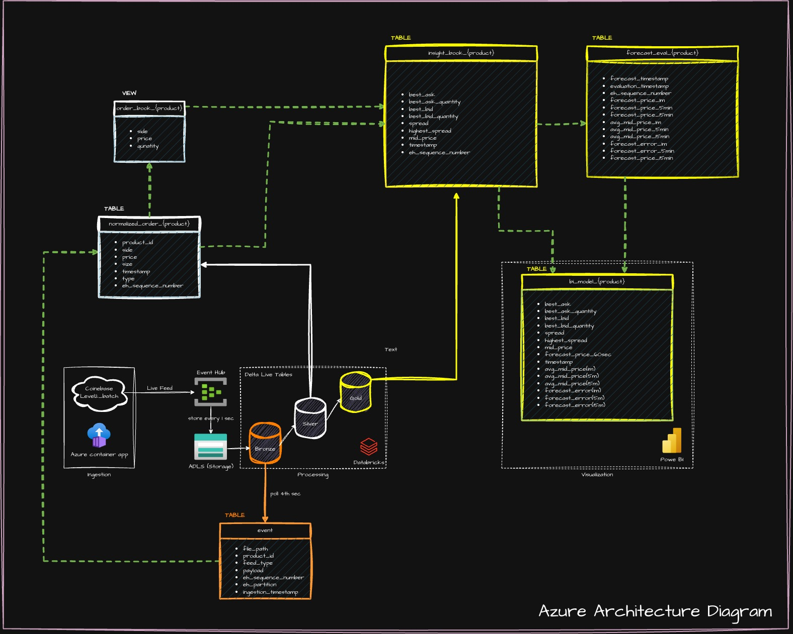

# Part 2: Azure Data Architecture

## Introduction

A Python service continuously ingests Coinbase `level2_batch` messages into
Azure Event Hubs. Event Hubs Capture archives the original messages as Avro
files in ADLS Gen2. Azure Databricks Lakeflow incrementally processes new files
through Bronze, Silver, and Gold Delta tables. End users query Gold through
Power BI, Databricks SQL, or an application.

Ingestion and downstream processing are continuous; serving can run on a
schedule. The five-second refresh requirement from Part 1 does not apply here.

## Architecture Overview



## Components

- **Azure Container Apps:** Maintains the Coinbase WebSocket connection and
  publishes each message in a small envelope. It handles ingestion only;
  order-book reconstruction and metrics run downstream.
- **Azure Event Hubs:** Provides a durable streaming buffer between ingestion
  and downstream storage. Partition by `product_id` and send each product's
  messages sequentially. Event Hubs assigns each accepted event a
  partition-scoped `SequenceNumber`.
- **ADLS Gen2:** Event Hubs Capture writes message envelopes and broker metadata,
  including `SequenceNumber`, to Avro files. The Capture path identifies the
  Event Hubs partition. Although Capture also records an offset, this design
  does not use it. The archive supports auditing and rebuilding without
  reconnecting to Coinbase.
- **Databricks / Lakeflow:** Reads newly captured files from ADLS and
  incrementally builds Bronze, Silver, and Gold Delta tables. Processing can be
  scheduled to balance insight latency and cost.
- **Power BI and other consumers:** Query Gold through Databricks SQL. Consumers
  do not need to reconstruct the order book from raw deltas.

## Data Flow

1. The producer wraps each Coinbase message with its channel, product,
  market-event timestamp, and ingestion timestamp. It publishes the envelope
  to Event Hubs using `product_id` as the partition key and sends each
  product's messages sequentially.
2. Event Hubs assigns each accepted event a partition-scoped `SequenceNumber`.
  Capture writes batches to ADLS, preserving this broker position in the Avro
  records. Lakeflow incrementally reads the captured files; Capture files and
  the live Event Hubs stream are separate inputs, not interchangeable sources.
3. A shared Bronze event table stores each original message, its Capture
  partition, `SequenceNumber`, and file name. Use
  `(eh_partition, eh_sequence_number)` as the broker-event key and validate
  continuity against the full partition stream.
4. Silver normalizes messages into price-level changes and applies them to each
  product's order book in `eh_sequence_number` order, preserving the
  changes-array order within each message. The resulting book supplies the
  best bid/ask prices and quantities.
5. For each `eh_sequence_number` in
  `silver.normalized_order_{product}`, the processor applies all price-level
  rows for that message, then reads the resulting levels from
  `silver.order_book_{product}`. It writes one observation to
  `gold.insight_book_{product}` using that sequence and the normalized event
  timestamp. Best bid/ask and quantities come from the resulting book; spread,
  running highest spread, and mid-price are derived from those paired levels.
  Emit one observation per complete feed message, not one per normalized
  price-level row, to avoid intermediate and inconsistent book snapshots.
6. For each forecast origin, the forecasting process writes one row to
  `gold.forecast_eval_{product}` with 1-, 5-, and 15-minute forecasts and the
  time-weighted rolling mid-price averages available at that origin. When
  valid observations arrive at or after each horizon target, it calculates
  the absolute forecast error and updates the corresponding error field and
  `evaluation_timestamp`. Errors for horizons not yet reached remain null.
7. Power BI or another consumer queries the Gold tables through Databricks SQL.
  It can show current observations from `gold.insight_book_{product}` and
  forecasts, averages, and evaluated errors from
  `gold.forecast_eval_{product}`. Serving can be scheduled or batched.

A Bronze envelope can look like:

```json
{
  "feed_type": "level2_batch",
  "event_timestamp": "2026-09-26T14:24:31.123Z",
  "ingestion_timestamp": "2026-09-26T14:24:31.245Z",
  "product_id": "BTC-USD",
  "payload": {
    "type": "l2update",
    "changes": [["buy", "65000.00", "1.25"]]
  }
}
```

The Coinbase payload stays unchanged inside `payload`. The envelope's
`event_timestamp` is market time; `ingestion_timestamp` is assigned when the
connector receives the message. `file_name` identifies the ADLS Capture file
containing the message.

## Data Models

| Layer/table | Grain and key | Main fields |
| --- | --- | --- |
| `bronze.event` | One captured broker record across all products; key `(eh_partition, eh_sequence_number)` | `product_id`, `type`<br>`event_timestamp`, `ingestion_timestamp`<br>`eh_partition`, `eh_sequence_number`<br>`payload`, `file_name` |
| `silver.normalized_order_{product}` | One normalized price-level change | `side`, `price`, `size`<br>`timestamp`, `type`<br>`eh_sequence_number` |
| `silver.order_book_{product}` | One current price level per product/side/price | `side`, `price`, `quantity` |
| `gold.insight_book_{product}` | One metric observation per processed event | `eh_sequence_number`, `timestamp`<br>`best_bid`, `best_bid_quantity`<br>`best_ask`, `best_ask_quantity`<br>`spread`, `highest_spread`, `mid_price` |
| `gold.forecast_eval_{product}` | One forecast record per forecast origin | `eh_sequence_number`, `forecast_timestamp`, `evaluation_timestamp`<br>`forecast_price_1m`, `forecast_price_5min`, `forecast_price_15min`<br>`avg_mid_price_1m`, `avg_mid_price_5min`, `avg_mid_price_15min`<br>`forecast_error_1m`, `forecast_error_5min`, `forecast_error_15min` |

`gold.insight_book_{product}` stores observations, not rolling-window
averages. Each row in `gold.forecast_eval_{product}` stores the three
predictions and rolling mid-price averages as of `forecast_timestamp`.

Evaluate each horizon at the first valid observed mid-price at or after its
target time. Populate that horizon's forecast error when evaluated; leave
unevaluated errors null. `evaluation_timestamp` records when the most recently
evaluated horizon was scored and advances as later horizons become due.

Assume each Coinbase snapshot contains the product's complete, non-empty
bid/ask book. Updates contain changed levels; size zero removes a price level.
Apply each message's changes together, in payload order. A snapshot replaces
all levels for its product; updates insert or overwrite positive sizes and
remove zero sizes.

In production, represent prices and quantities with decimal values or
product-specific integer ticks and lots rather than binary floating point.
Represent invalid-book periods explicitly and leave quote-derived metrics null.

## Rebuild and Restart

To rebuild a product's current book, filter the shared Bronze event table to
that product and find its latest snapshot by `eh_sequence_number`. Load the
snapshot's bid/ask levels into an empty book, then apply later updates in
increasing `eh_sequence_number`. Preserve the original payload order of each
message's `changes` array. Use market timestamps for time-based metrics, not to
order book mutations.

On a Lakeflow restart, resume from a durable file-source checkpoint and a state
checkpoint containing each product's book and metric state, plus the last
committed `eh_sequence_number` per Event Hubs partition. Commit state and
progress together so replay neither skips accepted broker records nor applies
the same record twice. Preserve recent valid mid-price samples, pending
forecasts, and highest-spread state.

## Azure Services

| Purpose | Azure service |
| --- | --- |
| Continuous ingestion | Azure Container Apps |
| Durable stream/buffer | Azure Event Hubs |
| Raw archive | Event Hubs Capture + ADLS Gen2 |
| Incremental medallion processing | Azure Databricks Lakeflow Spark Declarative Pipelines |
| Delta tables | Delta Lake on ADLS Gen2 |
| Query and serving | Databricks SQL Warehouse; Power BI or application clients |
| Identity and secrets | Managed identity and Azure Key Vault |
| Monitoring | Azure Monitor, Log Analytics, Databricks pipeline events |
