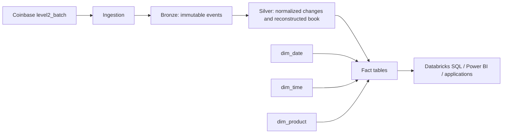

# Data Warehouse Design

This document describes a proposed dimensional analytics layer for the
Coinbase order-book monitor. It complements the [Azure architecture](azure-architecture.md):
Bronze, Silver, and Gold describe the processing layers, while the dimensions
and facts below describe an analytics-facing model that can be built from
those layers. This warehouse schema is a design, not an implementation in the
current Python application.

## Goals and Boundaries

- Preserve raw feed events so derived data can be audited and rebuilt.
- Maintain order-book state in event order before publishing market metrics.
- Give BI users a stable, product-centric model that avoids replaying raw feed
  updates for common analysis.
- Keep event time distinct from ingestion time and from the time a forecast is
  evaluated.

The live application currently holds its book and metrics in memory. The
separate [Azure design](azure-architecture.md) proposes durable capture and
incremental processing; it is the suggested source for populating this
warehouse. No dimensional tables or warehouse jobs are created by this
repository today.

## Logical Architecture

Bronze retains the original payload and transport metadata. Silver normalizes
the payload and reconstructs the current book per product. The warehouse facts
are populated from the resulting state and metrics, not by treating every
normalized price-level row as a complete market observation.

## Dimensional Model

Use conformed dimensions across facts so users can filter and group different
measures consistently. Dimension surrogate keys are warehouse-managed; the
natural product identifier remains available for traceability.

| Dimension | Grain | Suggested attributes |
| --- | --- | --- |
| `dim_date` | One calendar date | `date_key` (YYYYMMDD), `full_date`, `year`, `quarter`, `month`, `month_name`, `day_of_month`, `day_of_week`, `week_of_year` |
| `dim_time` | One second of day, or the finest supported reporting interval | `time_key`, `hour`, `minute`, `second`, `minute_of_day`, `hour_of_day` |
| `dim_product` | One Coinbase product identity/version | `product_key`, `product_id` (for example `BTC-USD`), `base_currency`, `quote_currency`, `product_name`, `effective_from`, `effective_to`, `is_current` |

Use `date_key` and `time_key` derived from the market event timestamp for
event-based facts. Store the original UTC timestamp on each fact as well. Set
the reporting timezone explicitly in semantic models; do not let a consumer's
local timezone silently change date and time keys. A product dimension may be
Type 1 if descriptive attributes never need historical tracking, or Type 2 if
changes must be reported as they were known at the time.

### Facts

| Fact | Grain | Key measures and context |
| --- | --- | --- |
| `fact_order_book_change` | One changed product/side/price level within one feed message | `event_id`, `product_key`, `date_key`, `time_key`, `event_timestamp`, `eh_partition`, `eh_sequence_number`, `side`, `price`, `quantity`, `change_type` |
| `fact_market_observation` | One complete observation after applying one feed message to the product book | `event_id`, `product_key`, `date_key`, `time_key`, `event_timestamp`, `eh_partition`, `eh_sequence_number`, `best_bid`, `best_bid_quantity`, `best_ask`, `best_ask_quantity`, `mid_price`, `spread`, `highest_spread` |
| `fact_forecast_evaluation` | One 60-second-ahead forecast at its forecast origin | `forecast_id`, `product_key`, origin date/time keys and timestamp, `target_timestamp`, `forecast_price_60sec`, nullable `evaluation_timestamp`, `observed_mid_price`, `absolute_error` |

`fact_order_book_change` preserves the event-level changes for audit and
reconstruction. It is not a snapshot fact: a row describes one requested level
change, and a quantity of zero means that level was removed. `fact_market_observation`
is the principal table for current and historical quote metrics. Its order-book
values are the resulting book after all changes in the source message have
been applied in payload order. For snapshot messages, publish one observation
after replacing the product's book.

The widest-spread measure is a running maximum, not the spread of the current
row. Either retain the running value in `fact_market_observation` as
`highest_spread` with its `highest_spread_timestamp`, bid, and ask context, or
derive it in a query over observations. Do not aggregate it by summing or
averaging; use `MAX` only when the requested population and time range match
the definition.

`fact_forecast_evaluation` has a delayed outcome: create a row when a forecast
is made, then update its evaluation fields when the first valid observation at
or after `target_timestamp` becomes available. Keep both target and evaluation
timestamps so delayed scoring remains visible. A row still awaiting its target
observation has null evaluation fields and must not be counted as a zero-error
forecast.

For large order books, avoid writing every unchanged level into a fact table on
each update. Store level changes for replay and audit; store the complete
best-bid/best-ask metrics as `fact_market_observation`. If point-in-time depth
queries are required, maintain a separate current-state table keyed by product,
side, and price, or introduce periodic full-book snapshots with an explicitly
documented snapshot grain.

## Metric Semantics

- **Mid-price:** `(best_bid + best_ask) / 2`, only when both sides of the book
  are valid.
- **Spread:** `best_ask - best_bid`, only when both sides are valid.
- **Rolling mid-price average:** elapsed-time-weighted over the trailing 1-,
  5-, or 15-minute window; do not average observations with equal weight unless
  that is a separately named metric.
- **Forecast:** linear trend over recent valid mid-price observations,
  extrapolated 60 seconds. The forecast horizon is independent of the
  evaluation-history window.
- **Forecast absolute error:** absolute difference between the forecast and
  the first valid observed mid-price at or after its target time.
- **Rolling forecast MAE:** arithmetic mean of evaluated absolute errors whose
  evaluation timestamps fall inside the trailing window. Pending forecasts do
  not contribute; a window with no evaluated forecasts is null.

For dashboard workloads, rolling metrics can be materialized in a separate
aggregate fact at one row per product and observation timestamp. Include the
window duration in column names (for example, `avg_mid_price_1m` and
`forecast_mae_15m`) and document that the 1-, 5-, and 15-minute MAE labels are
evaluation-history windows, not forecast horizons.

## Keys, Ordering, and Reliability

- Use `(eh_partition, eh_sequence_number)` as the broker-event identity where
  Event Hubs metadata is available. Sequence numbers are partition-scoped, so
  they are not globally unique by themselves.
- Preserve the order of changes within each message. Apply messages for a
  product in increasing broker sequence; use event timestamps for time-based
  analysis, not as a substitute for mutation order.
- Keep a stable source event identifier in the Bronze record for idempotent
  retries. Enforce uniqueness on the broker-event identity and fact grain.
- Persist the file-source position, product book state, and last committed
  sequence together. Reprocessing must be idempotent so a restart neither
  drops nor double-applies an accepted message.
- Rebuild a product by loading its latest snapshot and replaying subsequent
  updates in sequence order. This is also the recovery path when state needs to
  be repaired.
- Represent invalid or one-sided books explicitly. Leave quote-derived
  measures null rather than writing a misleading zero.

## Physical and Serving Guidance

Use decimal types or product-specific integer ticks and lots for prices and
quantities; avoid binary floating point in persisted warehouse facts. Retain
UTC event and ingestion timestamps, original payload, source file, partition,
and sequence metadata in Bronze for lineage.

Partition large Delta facts by a practical event-date column and cluster or
liquid-cluster by commonly filtered fields such as `product_key` and event
time. Avoid partitioning by high-cardinality values such as price or event ID.
Build BI views over the fact tables with friendly product labels and explicit
metric definitions. Grant consumers access to those views or Gold tables
through the chosen query service; do not make dashboards independently
reconstruct order-book state.

## Relationship to Existing Design

- [Design notes](design.md) document the implemented in-process pipeline and
  MinIO archive/consumer behavior.
- [Azure architecture](azure-architecture.md) describes a proposed durable
  Event Hubs, ADLS, and Databricks medallion pipeline and its existing Gold
  table grains.
- This document describes the dimensional serving model that can be layered
  over those processing tables. It does not replace Bronze/Silver/Gold or
  claim that the warehouse has been deployed.