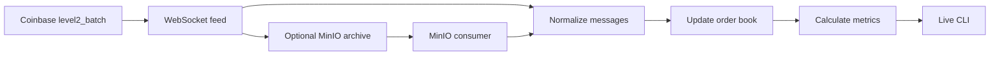

# Design Notes

For setup and commands, see the [README](../README.md).

## Feed Assumptions

- A Coinbase `level2_batch` snapshot represents the current order book. Updates
    provide the new total quantity at each price level, not a quantity delta; a
    zero quantity removes that level.
- The feed messages inspected do not contain a usable sequence number. A fresh
    snapshot restores the current book, but cannot recover missed update history.
- The CLI refreshes the display every five seconds. A refresh does not guarantee
    that a new market event or metric value is available; that depends on the
    feed.

## Processing Flow



In live mode, Coinbase messages go directly through normalization, the order
book, and metric calculation. In decoupled mode, a producer archives raw
messages to MinIO and a separate consumer sends them through the same
processing pipeline. Each process keeps its own book and metrics in memory.

## Project Structure

```text
src/marketdata/
    bronze/
        feed.py                 # Coinbase WebSocket client
        archiver.py             # Optional MinIO raw-message archive
    silver/
        normalize.py            # Raw messages to normalized records
        order_book.py           # Current in-memory bid/ask levels
    gold/
        mid_price_metrics.py
        spread_metrics.py
        forecast_metrics.py
    pipeline.py                 # Book and metric orchestration
    cli.py                      # Live, producer, and consumer modes
tests/                          # Unit tests for book and metrics
docs/                           # Design and Azure architecture notes
```

## Metrics

- **Mid-price:** `(best bid + best ask) / 2`. Rolling 1-, 5-, and 15-minute
  averages are time-weighted; periods without a valid two-sided book are
  excluded.
- **Spread:** `best ask - best bid`. The app tracks the widest observed spread
  during the process lifetime.
- **Forecast:** A 60-second linear trend over recent valid mid-price samples.
  Forecast errors are scored when their target time is reached.
- **Timestamps:** Coinbase event time drives metric windows. Local receive time
  is used only when the event timestamp is missing or invalid.
- **Book updates:** A snapshot replaces the entire book. An update changes the
  listed price levels; zero quantity removes a level.

## Limitations

- The MinIO consumer keeps its book and processed-object/event-ID sets in memory
  and does not persist a checkpoint. On startup, it lists the product's objects,
  searches backward in batches for the newest snapshot, then replays from that
  record forward. This limits replay to data since the snapshot, but object names
  are still listed on every poll. A durable checkpoint or latest-snapshot pointer
  could reduce that overhead further.
- The consumer can deduplicate repeated archived envelopes by event ID, but the
  feed provides no sequence number for detecting independently repeated source
  messages or reconstructing updates missed during a disconnection.

